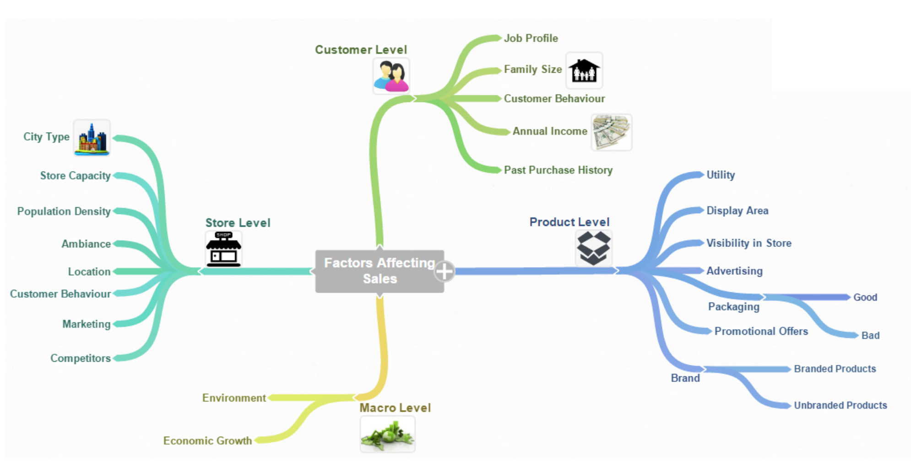

## R Markdown

Bismillahhirohmanirrohim, this is an R Markdown document that's we will learn how to publish analysis results as one of the data science activities .

## 1. Problem Statement

> " Sales Prediction for Big Mart Outlets The data scientists at BigMart have collected 2013 sales data for 1559 products across 10 stores in different cities. Also, certain attributes of each product and store have been defined. The aim is to build a predictive model and predict the sales of each product at a particular outlet. Using this model, BigMart will try to understand the properties of products and outlets which play a key role in increasing sales. Please note that the data may have missing values as some stores might not report all the data due to technical glitches. Hence, it will be required to treat them accordingly."

## 2. Hypothesis Generation

> "Teknis yang efektif untuk membangun hipotesis adalah merujuk pada 'main map'"

```{r echo=FALSE, out.width = "80%", fig.align = "center"}

```

#### Berikut dimana kita akan mengerjakan empaty level ( Toko/Storage, Product, Customers dan Makro ):

-   Storage/Toko hopotesis level

    1.  Type Toko , dimana yang berlokasi di perkotaan harusnya memiliki penjualan yang lebih tinggi karena tingkat pendapatan masyarakat leboih tinggi di sana.
    2.  Kepadatan penduduk , dengan kepadatan penduduk yang tinggi akan berimbang dengan tingkat penjualan yang tinggi.
    3.  Pesaing , dimana toko yang memiliki tempat serupa di dekatnya seharusnya memiliki penjualan yang lebih sedikit karena persaingan yang lebih besar terjadi.
    4.  Pemasaran , toko yahg memiliki team pemasaran yang baik harusnya memiliki hasil penjualan yang lebih tinggi.
    5.  Lokasi , toko yang terletak di dalam pasar terkenal akan memiliki penjualan yang lebih tinggi karena akses yang lebih mudah ke konsumen.
    6.  Suasana , toko yang di rawat dengan baik dan dikelola secara profesional akan memiliki tingkat penjualan yang tinggi.

-   Product hipotesis level

    1.  Merek , product yang bermerek akan meiliki peluang penjualan lebih tinggi
    2.  Pengemasan , product dengan kemasan yang baik dapat menarik pelanggan dan penjualan lebih baik.
    3.  Utilitas , product yang sering di gunakan kebutuhan setiap hari akan mmeiliki peluang tingkat penjualan yang tinggi.
    4.  Area Tampilan , product yang di beri rak lebih besar di toko cenderung menarik perhatian lebih dulu bagi pengunjung toko.
    5.  Visibilitas , product yang di tempatkan di lokasi penempatan dalam toko yang baik akan memiliki tingkat penjualan yang tinggi.
    6.  Periklanan , iklan product yang baik di toko akan menghasilkan penjualan lebih tinggi.
    7.  Penawaran promosi , product yang di sertai penawaran menarik dan diskon akan memiliki tingkat penjualan lebih tinggi.

-   Customers hipotesis level

    1.  Perilaku pelanggan , toko yang menjaga rangkaian product yang tepat untuk memenuhi kebutuhan pelanggan lokal akanmemiliki tingkat oenjualan yang tinggi.
    2.  Profil pelanggan , pelanggan yang bekerja di tingkat eksekutif akan memiliki peluang lebih tinggi untuk membeli product dalam jumlah besar di banding pelanggan yang bekerja di tingkat pemula atau menengah.
    3.  Ukuran keluarga , semakin banyak jumlah anggota keluarga, makin banyak jumlah yang akan di keluarkan oleh pelanggan untuk membeli product.
    4.  Pendapatan tahunan , semakin tinggi pendapatan tahunan pelanggan cenderung membeli product dengan biaya tinggi.
    5.  Riwayat pembelian sebelumnya , ketersediaaninformasi ini dapat membantu kami menentukan frequency pembelian suatu product oleh pengguna.

-   Makro hipotesis level

    1.  Lingkungan , jika memiliki lingkungan yang aman oleh pemerintah pelanggan akan lebih cenderung untuk membeli product tanpa khawatir ramah lingkungan atau tidak.
    2.  Pertumbuhan ekonomi , jika perekonomian saat ini menujukkan pertumbuhan yanhg konsisten, pendapatan per kapita akanmeningkat dan daya beli konsumen akan meningkat pula.


Dan masih banyak lagi faktoir lain yng mungkin bisa di tambahkan belum teridentifikasi di sini.

## 3. Loading Package and Data

> "Kami akan melibatkan beberapa paket yang belum di dukung di R dan di butuhkan dalam analisa berikut diantaranya untuk membaca data,memanipulasi data, visualisasi data dan terakhir untuk pemodelan untuk itu perlu di lakukan installasi paket tersebut terlebih dulu sebelum loading library terkait"

##### Dengan terlebih dulu mengisntall beberapa paket yang di butuhan seperti :

-   data.table , used for reading and manipulation of data
-   dplyr , used for data manipulation and joining
-   ggplot2 , used for ploting
-   caret , used for modeling
-   corrplot , used for making correlation plot
-   xgboost , used for building XGBoost model
-   cowplot , used for combining multiple plots

#### Jalankan library berikut:

```{r}
library(data.table) # used for reading and manipulation of data
library(dplyr) # used for data manipulation and joining
library(ggplot2) # used for ploting 
library(caret) # used for modeling
library(caret) # used for modeling 
library(corrplot) # used for making correlation plot
library(xgboost) # used for building XGBoost model
library(cowplot)    # used for combining multiple plots 
```

#### Dalam analisis ini kita memiliki 3 bahan data dalam format file CSV- Train, Test dan Sample Submissions.

#### Dan kita gunakan function ' fread() ; untuk loadding data pada workspace directory kita, pastikan dulu ;

```{r}
getwd() # kita membaca lokasi direktory dimana kita bekerja saat ini
```

#### Reading Data

```{r}
train = fread('Dataset_1/train_v9rqX0R.csv')
test = fread('Dataset_1/test_AbJTz2l.csv')
submission = fread('Dataset_1/sample_submission_8RXa3c6.csv')
```

#### Check Dimensions of our data

```{r}
dim(train)
dim(test)
```

#### Feature names of datasets

```{r}
names(train)
names(test)
```

## 4. Data Structure and Content

#### Structure of Data: str() gives summary of all features present in dataframe.

```{r}
str(train)
```

```{r}
str(test)
```

> " Kami akan menggabunbgkan kedua data train dan test terlebih dulu guna dilakukan tahapan ( visualize, feature re-enginering, one-hot-code dan code lable ) , untuk berikutnya akan dilakukan kembali split data saat melakukan train dan test secara terpisah"

##### Combine Train and Test

```{r}
test[, Item_Outlet_Sales := NA]
combi = rbind(train, test) #combining train and test datasets
dim(combi)
```

## 5. Exploratory Data Analysis

> " Untuk memahami sifat data dalam hal distribusi variable/feature individual serta emnemukan nilaiyang hilang yang berkorelasi dengan variable yang lain maka kita perlu melakukan tahapan EDA berikut dengan dua jalan pendekatan"

#### 5.1 Analisa Univariat

##### Target variable visualizing:

```{r}
ggplot(train)+geom_histogram(aes(train$Item_Outlet_Sales), binwidth = 100, fill = "darkgreen") + xlab("Item_Outlet_Sales")
```

###### Note : Variabel ini memiliki kecenderungan miring kanan dan membutuhkan beberapa transformasi data untuk menangani kemiringannya tersebut

#### Independent variables(numeric) visualizing:

```{r}
p1 = ggplot(combi)+geom_histogram(aes(Item_Weight), binwidth = 0.5, fill = "blue")
p2 = ggplot(combi)+geom_histogram(aes(Item_Visibility), binwidth = 0.005, fill = "blue")
p3 = ggplot(combi)+geom_histogram(aes(Item_MRP), binwidth = 1, fill = "blue")
plot_grid(p1, p2, p3, nrow = 1) # from cowplot package
```

#### Insight dari visualisasi ini adalah:

-   Sepertinya tidak ada pola potong yang jelas di Item_Weight
-   Item_Visibility miring ke kanan dan harus diubah untuk mengekang kemiringannya
-   Kita dapat melihat dengan jelas 4 distribusi berbeda untuk Item_MRP. hal ini sangat menarik untuk di analisa lebih lanjut.

#### Independent variables(Categorical) visualizing:

```{r}
ggplot(combi %>% group_by(Item_Fat_Content) %>% summarise(Count = n())) + geom_bar(aes(Item_Fat_Content, Count), stat = "identity", fill = "coral1")
```

#### Note:

-   Dalam tampilan grafik, 'LF','low fat', 'Low Fat', keduanya memiliki category sama dan dapat di combine jadi satu.
-   hal yang sama kita dapat combine 'reg' dan 'Regular'
-   after combining we'll plot the same fig again

```{r}
combi$Item_Fat_Content[combi$Item_Fat_Content=="LF"] = "Low Fat"
combi$Item_Fat_Content[combi$Item_Fat_Content=="low fat"] = "Low Fat"
combi$Item_Fat_Content[combi$Item_Fat_Content=="reg"] = "Regular"
ggplot(combi %>% group_by(Item_Fat_Content) %>% summarise(Count = n())) + geom_bar(aes(Item_Fat_Content, Count), stat = "identity", fill = "coral1")
```

#### now check other categorical variables

##### Plot for Item_Type

```{r}
p4 = ggplot(combi %>% group_by(Item_Type) %>% summarise(Count = n())) + geom_bar(aes(Item_Type, Count), stat = "identity", fill = "coral1") + xlab("")+geom_label(aes(Item_Type, Count, label = Count), vjust = 0.5)+theme(axis.text.x = element_text(angle = 45, hjust = 1))+ggtitle("Item_Type")
 
#plot for Outlet_Identifier
p5 = ggplot(combi %>% group_by(Outlet_Identifier) %>% summarise(Count = n())) + geom_bar(aes(Outlet_Identifier, Count), stat = "identity", fill = "coral1") + geom_label(aes(Outlet_Identifier, Count, label = Count), vjust = 0.5)+theme(axis.text.x = element_text(angle = 45, hjust = 1))

# plot for Outlet_Size
p6 = ggplot(combi %>% group_by(Outlet_Size) %>% summarise(Count = n())) + geom_bar(aes(Outlet_Size, Count), stat = "identity", fill = "coral1") + geom_label(aes(Outlet_Size, Count, label = Count), vjust = 0.5)+theme(axis.text.x = element_text(angle = 45, hjust = 1))

second_row = plot_grid(p5, p6, nrow = 1)
plot_grid(p4, second_row, ncol = 1)
```

##### Note :

-   Dalam plot Outlet_Size untuk pengamatan 4016, Outlet_Size kosong atau hilang.
-   Kami akan memeriksa ini dalam analisis bivariat untuk mengganti nilai yang hilang di Outlet_Size

#### Plot for Outlet_Establishment_Year

```{r}
p7 = ggplot(combi %>% group_by(Outlet_Establishment_Year) %>% summarise(Count = n())) + geom_bar(aes(factor(Outlet_Establishment_Year), Count), stat = "identity", fill = "coral1") + geom_label(aes(factor(Outlet_Establishment_Year), Count, label = Count), vjust = 0.5) + xlab("Outlet_Establishment_Year") + theme(axis.text.x = element_text(size = 8.5))

# Plot for Outlet_Type
p8 = ggplot(combi %>% group_by(Outlet_Type) %>% summarise(Count = n())) + geom_bar(aes(Outlet_Type, Count), stat = "identity", fill = "coral1") + geom_label(aes(factor(Outlet_Type), Count, label = Count), vjust = 0.5) + theme(axis.text.x = element_text(size = 8.5))

# Plotting both graphs together
plot_grid(p7, p8, ncol = 1)
```

#### Pengamatan dari gambar ini:

-   Kurang lebihnya . pengamatan dalam data untuk outlet yang didirikan pada tahun 1981 dibandingkan dengan yang lain Supermarket Type1 adalah paling populer

#### 5.2 Analisa Bivariat

> " Berikut nya kita akan mencari hubungan yang tersembunyi antara variable independent terhadap variable target dan menggunakan temuan tersebut dalam imputasi data yang hilang dan rekayasa fiture pada langkah berikutnya"

##### Item_Weight vs Item_Outlet_Sales

```{r}
p9 = ggplot(train) +      geom_point(aes(Item_Weight, Item_Outlet_Sales), colour = "violet", alpha = 0.3) +     theme(axis.title = element_text(size = 8.5))

# Item_Visibility vs Item_Outlet_Sales 
p10 = ggplot(train) +       geom_point(aes(Item_Visibility, Item_Outlet_Sales), colour = "violet", alpha = 0.3) +      theme(axis.title = element_text(size = 8.5))

# Item_MRP vs Item_Outlet_Sales 
p11 = ggplot(train) +       geom_point(aes(Item_MRP, Item_Outlet_Sales), colour = "violet", alpha = 0.3) +      theme(axis.title = element_text(size = 8.5))
 
second_row_2 = plot_grid(p10,p11, ncol=2)
plot_grid(p9,second_row_2, ncol=1)
```

#### Pengamatan :

-   Item_Outlet_Sales tersebar dengan baik diseluruh rentang Item_Weight tanpa pola yang jelas
-   Dalam Item_Visibility vs Item_Outlet_sales ada serangkaian poin pada Item_Visiility=0,0 yang tampak aneh karena visibilitas item tidak bisa sepenuhnya nol. Kami akan mencatat masalah ini dan menanganinya di tahap selanjutnya.
-   Di plot ketiga Item_MPR vs Item_Outlet_Sales, kita dapat dengan jelas melihat 4 segmen harga yang dapat digunakan dalam rekayasa fitur untuk membuat variable baru.

##### Variable Target vs Variable Independent

-   Kita akan menvisuloisasikan variable kategori sehubungan dengan Item_Outlet_Sales. Kita periksa distribusi variable target di semua kategori dari masing maisng variable kategori.

-   Kita akan menggunakan visual grafik pola biola di sini

-   Item_Type vs Item_Outlet_Sales

```{r}
p12 = ggplot(train) +       geom_violin(aes(Item_Type, Item_Outlet_Sales), fill = "magenta") +      theme(axis.text.x = element_text(angle = 45, hjust = 1),            axis.text = element_text(size = 6),            axis.title = element_text(size = 8.5))

# Item_Fat_Content vs Item_Outlet_Sales 
p13 = ggplot(train) +       geom_violin(aes(Item_Fat_Content, Item_Outlet_Sales), fill = "magenta") +      theme(axis.text.x = element_text(angle = 45, hjust = 1),            axis.text = element_text(size = 8),            axis.title = element_text(size = 8.5))

# Outlet_Identifier vs Item_Outlet_Sales 
p14 = ggplot(train) +       geom_violin(aes(Outlet_Identifier, Item_Outlet_Sales), fill = "magenta") +      theme(axis.text.x = element_text(angle = 45, hjust = 1),            axis.text = element_text(size = 8),            axis.title = element_text(size = 8.5))
 
second_row_3 = plot_grid(p13, p14, ncol = 2) 
plot_grid(p12, second_row_3, ncol = 1)
```

#### Note :

-   Distribusi untuk kategori OUT010 dan OUT019 dari Outlet_Identifier sangat mirip dan sangat berbeda dari kategori Outlet_Identifier lainnya.

#### Dalam analisis univariat, kami mengetahui tentang nilai kosong dalam variabel Outlet_Size. Mari kita periksa distribusi variabel target di Outlet_Size.

```{r}
ggplot(train) + geom_violin(aes(Outlet_Size, Item_Outlet_Sales), fill = "magenta")
```

-   Distribusi Outlet_Size 'Kecil' hampir identik dengan distribusi kategori kosong (biola pertama) dari Outlet_Size. Jadi, kita bisa mengganti bagian yang kosong di Outlet_Size dengan 'Kecil'.
-   Harap perhatikan bahwa ini bukan satu-satunya cara untuk menghubungkan nilai yang hilang, tetapi untuk saat ini kami akan melanjutkan dan menghubungkan nilai yang hilang dengan 'Kecil'.

#### Let's examine the remaining variables.

```{r}
p15 = ggplot(train) + geom_violin(aes(Outlet_Location_Type, Item_Outlet_Sales), fill = "magenta") 
p16 = ggplot(train) + geom_violin(aes(Outlet_Type, Item_Outlet_Sales), fill = "magenta") 
plot_grid(p15, p16, ncol = 1)
```

#### Note:

-   Lokasi Tier 1 dan Tier 3 dari Outlet_Location_Type terlihat serupa.
-   Dalam plot Outlet_Type, Grocery Store memiliki sebagian besar titik datanya di sekitar nilai penjualan yang lebih rendah dibandingkan dengan kategori lainnya.

## 6. Missing Value Treatment

#### You can try the following code to quickly find missing values in a variable.

```{r}
sum(is.na(combi$Item_Weight))
```

### Imputing Missing Value

#### We'll now impute Item_Weight with mean weight based on the Item_Identifier variable.

```{r}
missing_index = which(is.na(combi$Item_Weight)) 
for(i in missing_index){    
   item = combi$Item_Identifier[i]  
   combi$Item_Weight[i] = mean(combi$Item_Weight[combi$Item_Identifier == item], na.rm = T) 
 }

sum(is.na(combi$Item_Weight))
ggplot(combi) + geom_histogram(aes(Item_Visibility), bins = 100)
```

### Let's replace the zeroes

```{r}
zero_index = which(combi$Item_Visibility == 0) 
 for(i in zero_index){    
   item = combi$Item_Identifier[i]  
   combi$Item_Visibility[i] = mean(combi$Item_Visibility[combi$Item_Identifier == item], na.rm = T)  
 }
```

```{R}
ggplot(combi) + geom_histogram(aes(Item_Visibility), bins = 100)
```

## 7. Feature Engineering

#### In this section we will create the following new features:

-   Item_Type_new: Broader categories for the variable Item_Type.
-   Item_category: Categorical variable derived from Item_Identifier.
-   Outlet_Years: Years of operation for outlets.
-   price_per_unit_wt: Item_MRP/Item_Weight
-   Item_MRP_clusters: Binned feature for Item_MRP.

#### Kita dapat melihat variabel Item_Type dan mengklasifikasikan kategori menjadi perishable dan non_perishable sesuai pemahaman kita dan membuatnya menjadi fitur baru.

```{r}
perishable = c("Breads", "Breakfast", "Dairy", "Fruits and Vegetables", "Meat", "Seafood")
non_perishable = c("Baking Goods", "Canned", "Frozen Foods", "Hard Drinks", "Health and Hygiene", "Household", "Soft Drinks")
 
 
# create a new feature 'Item_Type_new' 

combi[,Item_Type_new := ifelse(Item_Type %in% perishable, "perishable", ifelse(Item_Type %in% non_perishable, "non_perishable", "not_sure"))]

 
# Let’s compare Item_Type with the first 2 characters of Item_Identifier, i.e., ‘DR’, ‘FD’, and ‘NC’. These identifiers most probably stand for drinks, food, and non-consumable.
 
table(combi$Item_Type, substr(combi$Item_Identifier, 1, 2))
```

#### table(combi\$Item_Type)

#### Based on the above table we can create a new feature. Let's call it Item_category.

```{r}
combi[,Item_category := substr(combi$Item_Identifier, 1, 2)]
# table(combi$Item_Identifier)
# table(combi$Item_Type)

# Based on the above table we can create a new feature. Let’s call it Item_category.
combi[,Item_category := substr(combi$Item_Identifier, 1, 2)]
 
#### We will also change the values of Item_Fat_Content wherever Item_category is ‘NC’ because non-consumable items cannot have any fat content. We will also create a couple of more features — Outlet_Years (years of operation) and price_per_unit_wt (price per unit weight).

combi$Item_Fat_Content[combi$Item_category == "NC"] = "Non-Edible" 

# years of operation for outlets 
combi[,Outlet_Years := 2013 - Outlet_Establishment_Year] 
combi$Outlet_Establishment_Year = as.factor(combi$Outlet_Establishment_Year)## what is this for?
 
# Price per unit weight 
combi[,price_per_unit_wt := Item_MRP/Item_Weight]

# Earlier in the Item_MRP vs Item_Outlet_Sales plot, we saw Item_MRP was spread across in 4 chunks. Now let’s assign a label to each of these chunks and use this label as a new variable.
 
# creating new independent variable - Item_MRP_clusters 
combi[,Item_MRP_clusters := ifelse(Item_MRP < 69, "1st", ifelse(Item_MRP >= 69 & Item_MRP < 136, "2nd", ifelse(Item_MRP >= 136 & Item_MRP < 203, "3rd", "4th")))]
```

## 8. Encoding Categorical Variables

#### Kami akan memberi label mengkodekan Outlet_Size dan Outlet_Location_Type karena ini adalah variabel ordinal(skala).

```{r}
combi[,Outlet_Size_num := ifelse(Outlet_Size == "Small", 0, ifelse(Outlet_Size == "Medium", 1, 2))] 
combi[,Outlet_Location_Type_num := ifelse(Outlet_Location_Type == "Tier 3", 0, ifelse(Outlet_Location_Type == "Tier 2", 1, 2))]
 
# removing categorical variables after label encoding 
combi[, c("Outlet_Size", "Outlet_Location_Type") := NULL]
 
# One hot encoding for the categorical variable
ohe = dummyVars("~.", data = combi[,-c("Item_Identifier", "Outlet_Establishment_Year", "Item_Type")], fullRank = T) 
ohe_df = data.table(predict(ohe, combi[,-c("Item_Identifier", "Outlet_Establishment_Year", "Item_Type")])) 
combi = cbind(combi[,"Item_Identifier"], ohe_df)
```

## 9. Pre processing of Data

-   Beberapa metode machine learning mengasumsikan data terdistribusi normal dan 'skewnes/miring variable' dapat diubah dengan mengambil log, akar kuadrat, atau akar pangkat tiga sehingga distribusinya sedekat mungkin dengan distribusi normal.
-   Dalam data kami, variabel Item_Visibility dan price_per_unit_wt sangat miring. Jadi, kami akan menangani kemiringannya dengan bantuan transformasi log.

#### combi[,Item_Visibility]

```{r}
combi[,Item_Visibility := log(Item_Visibility + 1)] # log + 1 to avoid division by zero 
 
# combi[,price_per_unit_wt]
combi[,price_per_unit_wt := log(price_per_unit_wt + 1)]
```

#### combi[,price_per_unit_wt]

#### combi[,Item_Visibility]

-   Mari skalakan dan pusatkan variabel numerik untuk membuatnya memiliki rata-rata 0, standar deviasi 1, dan skala 0 hingga 1.
-   Penskalaan dan pemusatan diperlukan untuk model regresi linier.

```{r}
num_vars = which(sapply(combi, is.numeric)) # index of numeric features 
num_vars_names = names(num_vars) 
combi_numeric = combi[,setdiff(num_vars_names, "Item_Outlet_Sales"), with = F] 
prep_num = preProcess(combi_numeric, method=c("center", "scale")) 
combi_numeric_norm = predict(prep_num, combi_numeric)
combi[,setdiff(num_vars_names, "Item_Outlet_Sales") := NULL] # removing numeric independent variables 
combi = cbind(combi, combi_numeric_norm)
```

#### Splitting the combined data combi back to train and test set.

```{r}
train = combi[1:nrow(train)] 
test = combi[(nrow(train) + 1):nrow(combi)] 
test[,Item_Outlet_Sales := NULL] # removing Item_Outlet_Sales as it contains only NA for test dataset
```

#### Tidak dibutuhkan lagi memiliki fitur yang berkorelasi jika kita menggunakan regresi linier.

```{r}
cor_train = cor(train[,-c("Item_Identifier")]) 
corrplot(cor_train, method = "pie", type = "lower", tl.cex = 0.5)
```

## 10. Modeling

### Linear Regression

```{r}
linear_reg_mod = lm(Item_Outlet_Sales ~ ., data = train[,-c("Item_Identifier")])
 
# Making Predictions on test Data
# preparing dataframe for submission and writing it in a csv file 
submission$Item_Outlet_Sales = predict(linear_reg_mod, test[,-c("Item_Identifier")])
write.csv(submission, "Linear_Reg_submit.csv", row.names = F)
```

### Regularized Linear Regression

```{r}
set.seed(1235)
my_control = trainControl(method="cv", number=5) 
Grid = expand.grid(alpha = 1, lambda = seq(0.001,0.1,by = 0.0002)) 
lasso_linear_reg_mod = train(x = train[, -c("Item_Identifier", "Item_Outlet_Sales")], y = train$Item_Outlet_Sales, method='glmnet', trControl= my_control, tuneGrid = Grid)

```

```{r}
my_control = trainControl(method="cv", number=5) 
Grid = expand.grid(alpha = 1, lambda = seq(0.001,0.1,by = 0.0002)) 
lasso_linear_reg_mod = train(x = train[, -c("Item_Identifier", "Item_Outlet_Sales")], y = train$Item_Outlet_Sales, method='glmnet', trControl= my_control, tuneGrid = Grid)
 
my_control = trainControl(method="cv", number=5)
Grid = expand.grid(alpha = 1, lambda = seq(0.001,0.1,by = 0.0002))
lasso_linear_reg_mod = train(x = train[, -c("Item_Identifier", "Item_Outlet_Sales")], y = train$Item_Outlet_Sales, method='glmnet', trControl= my_control, tuneGrid = Grid)
```

### Ridge Regression

```{r}
set.seed(1236) 
my_control = trainControl(method="cv", number=5) 
Grid = expand.grid(alpha = 0, lambda = seq(0.001,0.1,by = 0.0002)) 
ridge_linear_reg_mod = train(x = train[, -c("Item_Identifier", "Item_Outlet_Sales")], y = train$Item_Outlet_Sales,method='glmnet', trControl= my_control, tuneGrid = Grid)
```

### RandomForrest

```{r}
set.seed(1237)
my_control = trainControl(method="cv", number=5) # 5-fold CV
 tgrid = expand.grid(
   .mtry = c(3:10),
   .splitrule = "variance",
   .min.node.size = c(10,15,20)
 )
```

```{r}
 rf_mod = train(x = train[, -c("Item_Identifier", "Item_Outlet_Sales")],
                y = train$Item_Outlet_Sales,
                method='ranger',
                trControl= my_control,
                tuneGrid = tgrid,
                num.trees = 400,
                importance = "permutation")
```

# Our score on the leaderboard has improved considerably by using RandomForest.

# Now let's visualize the RMSE scores for different tuning parameters.

```{r}
plot(rf_mod)
```

# As per the plot shown above, the best score is achieved at mtry = 5 and min.node.size = 20.

# Let's plot feature importance based on the RandomForest model

```{r}
plot(varImp(rf_mod))
```

#### Seperti yang diharapkan Item_MRP adalah variabel terpenting dalam memprediksi variabel target. Fitur baru yang kami buat, seperti price_per_unit_wt, Outlet_Years, Item_MRP_Clusters, juga merupakan variabel paling penting teratas.Inilah sebabnya rekayasa fitur memainkan peran penting dalam pemodelan prediktif
